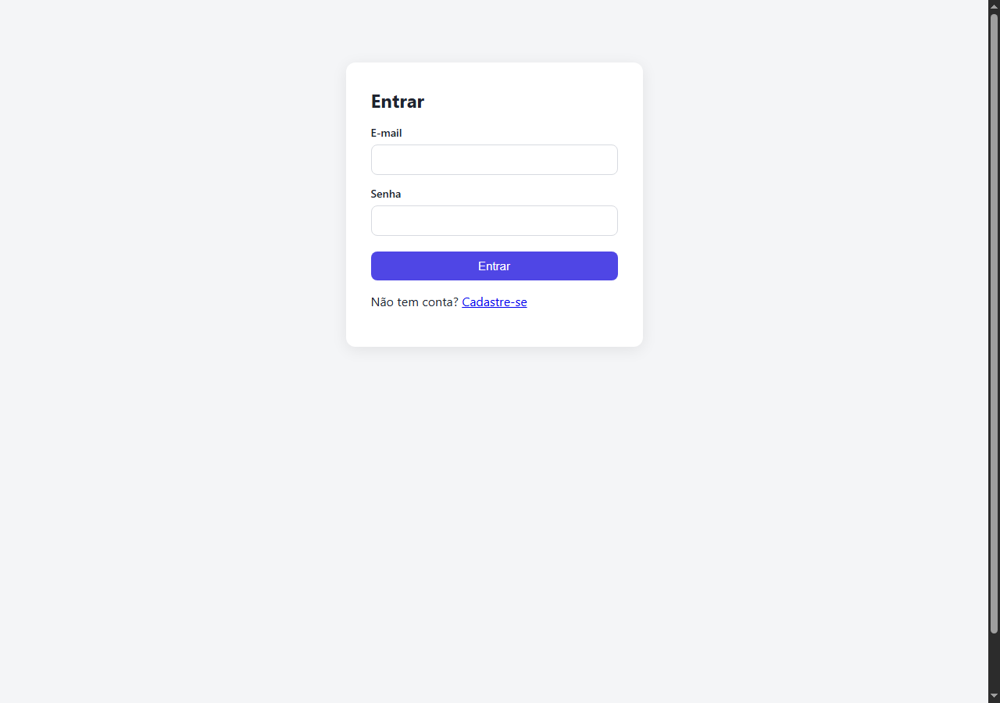
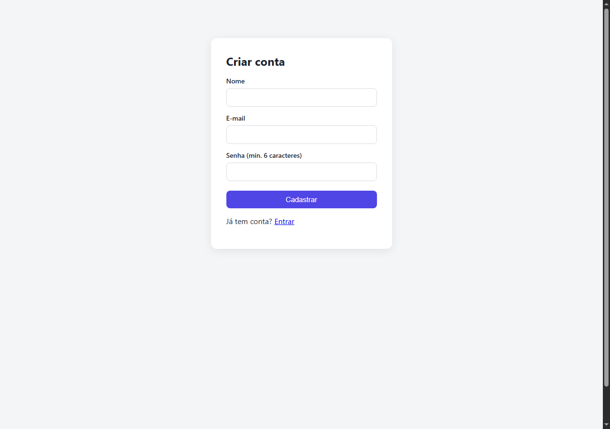

# 📌 Sistema com Login + CRUD de Tarefas

> Aplicação full stack com autenticação JWT e CRUD de tarefas por usuário. Backend em Node.js/Express + PostgreSQL (SQLite no desenvolvimento), frontend em React.


[](LICENSE)

> 🌱 Projeto de aprendizado, feito enquanto eu estudava autenticação JWT e desenvolvimento full stack com Node.js e React.

## 🔗 Links

- 🚀 **Deploy:** [login-crud-app-seven.vercel.app](https://login-crud-app-seven.vercel.app)
- 🔑 **Conta de demonstração:** `demo@exemplo.com` / `demo1234` (ou crie a sua pelo cadastro)

> ⚠️ Frontend na Vercel e API no plano gratuito do Render. Um workflow no GitHub Actions faz um ping a cada 10 min para manter a instância acordada, mas a primeira requisição ainda pode levar alguns segundos. A conta demo é recriada automaticamente se o banco for zerado.

## 🧠 Sobre o projeto

Este projeto implementa o fluxo mais comum de qualquer aplicação web real: cadastro, login autenticado com JWT e um CRUD protegido, onde cada usuário só vê e gerencia suas próprias tarefas. Foi construído para demonstrar boas práticas de autenticação (hash de senha, tokens com expiração, proteção de rotas) tanto no backend quanto no consumo dessa API pelo frontend.

## ✨ Funcionalidades

- Cadastro de usuário com validação (nome, e-mail único, senha mínima de 6 caracteres)
- Login com geração de token JWT (expira em 7 dias)
- Senhas armazenadas com hash (bcrypt), nunca em texto puro
- CRUD de tarefas: criar, listar, marcar como concluída, excluir
- Isolamento de dados: cada usuário só acessa suas próprias tarefas (validado no backend, não só escondido no frontend)
- Rotas de tarefas protegidas por middleware de autenticação
- Testes de integração no backend cobrindo autenticação e CRUD (incluindo tentativa de acessar tarefa de outro usuário)

## 🖥️ Prints

| Login | Cadastro |
|---|---|
|  |  |

## 🛠️ Tecnologias

**Backend**
- Node.js + Express
- PostgreSQL em produção (`pg`) e SQLite no desenvolvimento/testes (better-sqlite3)
- bcryptjs (hash de senha)
- jsonwebtoken (autenticação JWT)
- Jest + Supertest (testes de integração)

**Frontend**
- React 18 + Vite
- React Router (rotas protegidas)
- Axios (consumo da API, com interceptor de token)
- Context API para estado de autenticação

## 📂 Estrutura do projeto

```
login-crud/
├── backend/
│   ├── src/
│   │   ├── routes/       # auth.js, tarefas.js
│   │   ├── middleware/   # auth.js (verificação de JWT)
│   │   ├── __tests__/    # testes Jest + Supertest
│   │   ├── db.js
│   │   ├── app.js
│   │   └── server.js
│   └── package.json
├── frontend/
│   ├── src/
│   │   ├── pages/        # Login, Registrar, Tarefas
│   │   ├── context/      # AuthContext
│   │   ├── api/          # client axios
│   │   └── App.jsx
│   └── package.json
└── README.md
```

## ▶️ Como rodar localmente

### Backend

```bash
git clone https://github.com/Kashalicov/login-crud-app.git
cd login-crud-app/backend

cp .env.example .env
npm install
npm run dev
# API disponível em http://localhost:3333
```

### Frontend

```bash
cd ../frontend
cp .env.example .env
npm install
npm run dev
# aplicação disponível em http://localhost:5173
```

## ✅ Testes

```bash
cd backend
npm test
```

Cobre: registro (com validações e e-mail duplicado), login (sucesso e falha), e CRUD de tarefas (criação, listagem, atualização, exclusão e isolamento entre usuários).

## 📚 O que eu aprendi

Esse projeto me fez entender na prática por que autenticação "de verdade" não é só validar usuário e senha: é preciso pensar em hash de senha, expiração de token, e principalmente em autorização — garantir no backend que um usuário não pode acessar ou modificar dados de outro, mesmo que tente manipular a URL ou o ID da tarefa diretamente. Escrever um teste especificamente para esse cenário ("não permite atualizar tarefa de outro usuário") foi um dos aprendizados mais importantes do projeto.

## 🚧 Possíveis melhorias futuras

- Refresh token e logout que invalida o token no servidor
- Paginação e filtros na listagem de tarefas
- Recuperação de senha por e-mail

## 👤 Autor

**Júnior Rodrigues**
Coordenador de T.I. na Fundação Banco de Olhos | Estudante de Ciência da Computação

📫 [LinkedIn](https://www.linkedin.com/in/jrkdev/) · [GitHub](https://github.com/Kashalicov)
